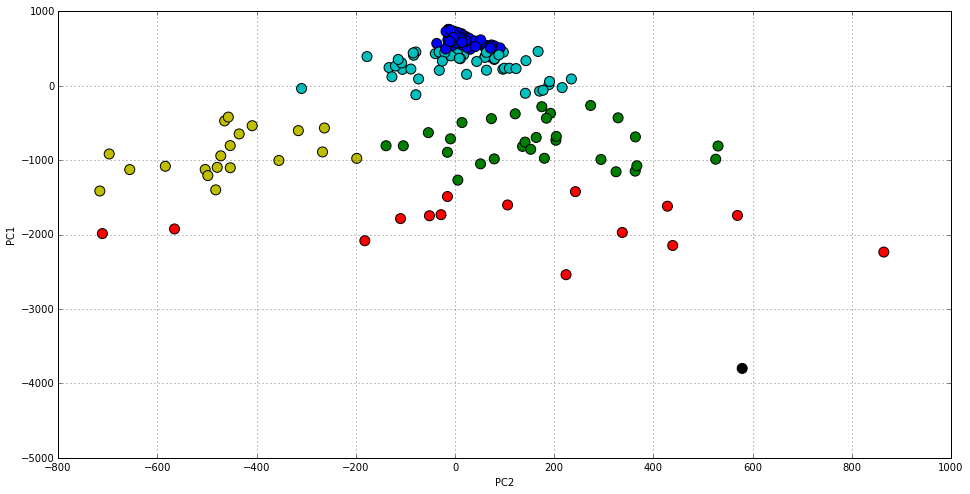
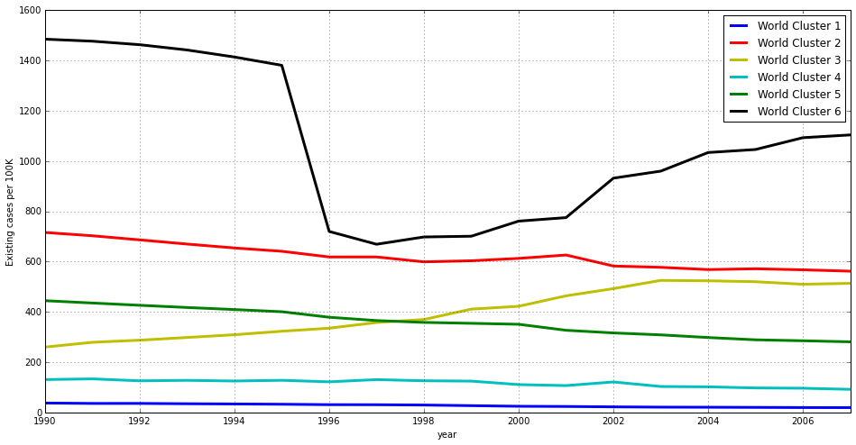

# World differences in infectious tuberculosis prevalence

> [From Wikipedia, the free
encyclopedia](https://en.wikipedia.org/wiki/Tuberculosis)

> Tuberculosis, MTB, or TB (short for tubercle bacillus), in the past also
called phthisis, phthisis pulmonalis, or consumption, is a widespread, and in
many cases fatal, infectious disease caused by various strains of mycobacteria,
usually Mycobacterium tuberculosis. Tuberculosis typically attacks the lungs,
but can also affect other parts of the body. It is spread through the air when
people who have an active TB infection cough, sneeze, or otherwise transmit
respiratory fluids through the air. Most infections do not have symptoms, known
as latent tuberculosis. About one in ten latent infections eventually progresses
to active disease which, if left untreated, kills more than 50% of those so
infected.

In this first approach to the world situation regarding infectious tuberculosis
we want to have a look at how different countries have been affected by the
disease in the period from 1990 to 2007. By doing so we want to better
understand different trends in the prevalence of this important disease. Which
countries are getting better and worse? Are there more or less clear groups of
countries based on how much are the affected and how their situation is
changeing?

This should be enough for a first approach that opens the door to future works
in finding the reasons for this situation and how the different approaches to
fight the disease have been doing.

The [Gapminder website](http://www.gapminder.org/) presents itself as *a fact-
based worldview*. It is a comprehensive resource for data regarding different
countries and territories indicators. For this article, we will use a dataset
related to [estimated prevalence (existing cases) per 100K](https://docs.google.
com/spreadsheets/d/1X5Jp7Q8pTs3KLJ5JBWKhncVACGsg5v4xu6badNs4C7I/pub?gid=0)
coming from the World Health Organization (WHO). We invite the reader to repeat
the process with the new cases and deaths datasets and share the results. Our
data contains up to 207 countries. The first few of them looks as follows:

    import urllib
    
    tb_existing_url_csv = 'https://docs.google.com/spreadsheets/d/1X5Jp7Q8pTs3KLJ5JBWKhncVACGsg5v4xu6badNs4C7I/pub?gid=0&output=csv'
    local_tb_existing_file = 'tb_existing_100.csv'
    existing_f = urllib.urlretrieve(tb_existing_url_csv, local_tb_existing_file)
    
    import pandas as pd
    
    existing_df = pd.read_csv(local_tb_existing_file, index_col = 0, thousands  = ',')
    existing_df.index.names = ['country']
    existing_df.columns.names = ['year']
    
    existing_df.head()

<table border="1" class="dataframe">
  <thead>
    <tr style="text-align: right;">
      <th>year</th>
      <th>1990</th>
      <th>1991</th>
      <th>1992</th>
      <th>1993</th>
      <th>1994</th>
      <th>1995</th>
      <th>1996</th>
      <th>1997</th>
      <th>1998</th>
      <th>1999</th>
      <th>2000</th>
      <th>2001</th>
      <th>2002</th>
      <th>2003</th>
      <th>2004</th>
      <th>2005</th>
      <th>2006</th>
      <th>2007</th>
    </tr>
    <tr>
      <th>country</th>
      <th></th>
      <th></th>
      <th></th>
      <th></th>
      <th></th>
      <th></th>
      <th></th>
      <th></th>
      <th></th>
      <th></th>
      <th></th>
      <th></th>
      <th></th>
      <th></th>
      <th></th>
      <th></th>
      <th></th>
      <th></th>
    </tr>
  </thead>
  <tbody>
    <tr>
      <th>Afghanistan</th>
      <td> 436</td>
      <td> 429</td>
      <td> 422</td>
      <td> 415</td>
      <td> 407</td>
      <td> 397</td>
      <td> 397</td>
      <td> 387</td>
      <td> 374</td>
      <td> 373</td>
      <td> 346</td>
      <td> 326</td>
      <td> 304</td>
      <td> 308</td>
      <td> 283</td>
      <td> 267</td>
      <td> 251</td>
      <td> 238</td>
    </tr>
    <tr>
      <th>Albania</th>
      <td>  42</td>
      <td>  40</td>
      <td>  41</td>
      <td>  42</td>
      <td>  42</td>
      <td>  43</td>
      <td>  42</td>
      <td>  44</td>
      <td>  43</td>
      <td>  42</td>
      <td>  40</td>
      <td>  34</td>
      <td>  32</td>
      <td>  32</td>
      <td>  29</td>
      <td>  29</td>
      <td>  26</td>
      <td>  22</td>
    </tr>
    <tr>
      <th>Algeria</th>
      <td>  45</td>
      <td>  44</td>
      <td>  44</td>
      <td>  43</td>
      <td>  43</td>
      <td>  42</td>
      <td>  43</td>
      <td>  44</td>
      <td>  45</td>
      <td>  46</td>
      <td>  48</td>
      <td>  49</td>
      <td>  50</td>
      <td>  51</td>
      <td>  52</td>
      <td>  53</td>
      <td>  55</td>
      <td>  56</td>
    </tr>
    <tr>
      <th>American Samoa</th>
      <td>  42</td>
      <td>  14</td>
      <td>   4</td>
      <td>  18</td>
      <td>  17</td>
      <td>  22</td>
      <td>   0</td>
      <td>  25</td>
      <td>  12</td>
      <td>   8</td>
      <td>   8</td>
      <td>   6</td>
      <td>   5</td>
      <td>   6</td>
      <td>   9</td>
      <td>  11</td>
      <td>   9</td>
      <td>   5</td>
    </tr>
    <tr>
      <th>Andorra</th>
      <td>  39</td>
      <td>  37</td>
      <td>  35</td>
      <td>  33</td>
      <td>  32</td>
      <td>  30</td>
      <td>  28</td>
      <td>  23</td>
      <td>  24</td>
      <td>  22</td>
      <td>  20</td>
      <td>  20</td>
      <td>  21</td>
      <td>  18</td>
      <td>  19</td>
      <td>  18</td>
      <td>  17</td>
      <td>  19</td>
    </tr>
  </tbody>
</table>

The reader can check the [complete datasets](https://docs.google.com/spreadsheet
s/d/1X5Jp7Q8pTs3KLJ5JBWKhncVACGsg5v4xu6badNs4C7I/pub?gid=0) from the Gapminder
website.

## A visual to the world distribution of existing cases

Data tables are accurate and complete. However they are not always the best way
to process information, specially in our case where we want to understand how
each country relates to others. The following chart is a two dimensional
representation of the same data, that originally has 18 different dimensions,
one for each year. In the vertical axis we represent the first dimension of
variation within countries, that in this case is related with where the country
relates to others regarding the number of cases as an static magnitude (e.g. the
sum across the years). Those countries at the top of the chart are countries
less affected by the disease.

In the horizontal axis we have coded how the number of existing cases has
changed from 1990 to 2007. Countries in the left hand side of the chart have
increased the number of cases in that period of time.

    from sklearn.decomposition import PCA
    
    pca = PCA(n_components=2)
    pca.fit(existing_df)
    
    existing_2d = pca.transform(existing_df)
    existing_df_2d = pd.DataFrame(existing_2d)
    existing_df_2d.index = existing_df.index
    existing_df_2d.columns = ['PC1','PC2']
    
    %matplotlib inline
    
    ax = existing_df_2d.plot(kind='scatter', x='PC2', y='PC1', figsize=(16,8))
    
    for i, country in enumerate(existing_df.index):
        ax.annotate(country, (existing_df_2d.iloc[i].PC2, existing_df_2d.iloc[i].PC1))

There are more countries at the very top and on the right hand side. That is,
there are more countries with relatively less cases and that have improved their
situation with time. But there are some facts that makes us want to keep
exploring our data:
- The distribution is not uniform. There is a high concentration of countries at
the very top. This means that there are a group of countries able to deal with
the disease in a way that is not accesible to many more (i.e. those countries
over and under the 0 line in the vertical axis respectively).
- There are countries that, far from improving its situation in the 1990-2007
period has most of them have done, ended up with more cases in 2007 than they
had in 1990.
- There is a country, [Djibouti](https://en.wikipedia.org/wiki/Djibouti) that
lies quite outside of the rest and might need closer attention.

## Groping countries based on their situation  

By [clustering](https://en.wikipedia.org/wiki/Cluster_analysis) our original
dataset, we will colour the previous chart in order to identify up to six
different groups. This is the minimal number of clusters that we have observed
better (and more consistently) separates them in order to have a look at the
center of each cluster, and try to understand different world tendencies and
differences.

    import numpy as np
    from sklearn.cluster import KMeans
    
    np.random.seed(1234)
    kmeans = KMeans(n_clusters=6)
    clusters = kmeans.fit(existing_df)
    existing_df_2d['cluster'] = pd.Series(clusters.labels_, index=existing_df_2d.index)
    
    import numpy as np
    styles = ['b','r','y','c','g','k']
    existing_df_2d.plot(
        kind='scatter',
        x='PC2',y='PC1',
        c=[styles[i] for i in existing_df_2d.cluster.astype(np.int)],
        s=100,
        figsize=(16,8))

    <matplotlib.axes._subplots.AxesSubplot at 0x7f275545c8d0>

Most clusters divide the distribution vertically (i.e. based on the absolute
number of cases) but there is also a division in the horizontal axis that we
will have a look at. In order to complement this view, let's have a look at the
same data as a line chart that represents how each cluster representative
evolves over time.

    cluster_centers_df = pd.DataFrame(
        clusters.cluster_centers_, 
        index=['World Cluster 1', 'World Cluster 2', 'World Cluster 3', 'World Cluster 4', 'World Cluster 5', 'World Cluster 6']) 
    cluster_centers_df.columns = existing_df.columns
    
    ax = cluster_centers_df.T.plot(
        figsize=(16,8),
        style=styles,
        linewidth = 3)
    ax.set_ylabel("Existing cases per 100K")

    <matplotlib.text.Text at 0x7f2755465110>

Let's analyse each of these world clusters or groups in detail.

### World Cluster 1

    sum(clusters.labels_ == 0)

    90

There are 90 countries in the first cluster, and these are:

    existing_df_2d[existing_df_2d.cluster == 0].index

    Index([u'Albania', u'Algeria', u'American Samoa', u'Andorra', u'Anguilla', u'Antigua and Barbuda', u'Argentina', u'Australia', u'Austria', u'Bahamas', u'Barbados', u'Belgium', u'Belize', u'Bermuda', u'British Virgin Islands', u'Bulgaria', u'Canada', u'Cayman Islands', u'Chile', u'Colombia', u'Cook Islands', u'Costa Rica', u'Cuba', u'Cyprus', u'Czech Republic', u'Denmark', u'Dominica', u'Egypt', u'Estonia', u'Fiji', u'Finland', u'France', u'French Polynesia', u'Germany', u'Greece', u'Grenada', u'Hungary', u'Iceland', u'Iran', u'Ireland', u'Israel', u'Italy', u'Jamaica', u'Japan', u'Jordan', u'Kuwait', u'Lebanon', u'Libyan Arab Jamahiriya', u'Luxembourg', u'Malta', u'Mauritius', u'Mexico', u'Monaco', u'Montserrat', u'Netherlands', u'Netherlands Antilles', u'New Caledonia', u'New Zealand', u'Norway', u'Oman', u'Panama', u'Poland', u'Portugal', u'Puerto Rico', u'Saint Kitts and Nevis', u'Saint Lucia', u'Saint Vincent and the Grenadines', u'Samoa', u'San Marino', u'Saudi Arabia', u'Singapore', u'Slovakia', u'Slovenia', u'Spain', u'Sweden', u'Switzerland', u'Syrian Arab Republic', u'Macedonia, FYR', u'Tonga', u'Trinidad and Tobago', u'Tunisia', u'Turkey', u'Turks and Caicos Islands', u'United Arab Emirates', u'United Kingdom', u'Virgin Islands (U.S.)', u'United States of America', u'Uruguay', u'Venezuela', u'West Bank and Gaza'], dtype='object')

The center of this cluster gives us an idea of how an average country might look
like:

    cluster_centers_df.loc['World Cluster 1']

    year
    1990    37.277778
    1991    35.688889
    1992    35.733333
    1993    34.400000
    1994    33.511111
    1995    32.422222
    1996    30.800000
    1997    30.511111
    1998    29.300000
    1999    26.777778
    2000    24.355556
    2001    23.577778
    2002    22.022222
    2003    20.933333
    2004    20.488889
    2005    19.922222
    2006    19.255556
    2007    19.111111
    Name: World Cluster 1, dtype: float64

Although this group of countries might be a bit too large and heterogeneous, and
probably needs further refinement, it is a good grouping when comparing their
situation to that of other countries in the world. In any case it contains those
countries with less number of existing cases in our set.

### World Cluster 2

    sum(clusters.labels_ == 1)

    15

There are just 15 countries in this small group. These are:

    existing_df_2d[existing_df_2d.cluster == 1].index

    Index([u'Bangladesh', u'Bhutan', u'Cambodia', u'Korea, Dem. Rep.', u'Kiribati', u'Mali', u'Mauritania', u'Namibia', u'Philippines', u'Sierra Leone', u'South Africa', u'Swaziland', u'Timor-Leste', u'Togo', u'Zambia'], dtype='object')

Apart from the world cluster 6, that is formed by a single country as we will
see, this group is represented by the centroid with the highest prevalence of
tuberculosis per 100K:

    cluster_centers_df.loc['World Cluster 2']

    year
    1990    715.933333
    1991    702.800000
    1992    686.400000
    1993    669.800000
    1994    654.200000
    1995    641.066667
    1996    618.400000
    1997    618.466667
    1998    599.000000
    1999    603.333333
    2000    612.733333
    2001    626.200000
    2002    582.400000
    2003    577.200000
    2004    568.266667
    2005    571.466667
    2006    567.400000
    2007    561.866667
    Name: World Cluster 2, dtype: float64

These are by all means the countries with the most tuberculosis cases every
year. We can also see that the number of cases descends progressively. The total
decrease between 1990 and 2007 is over 20%.

### World Cluster 3

    sum(clusters.labels_ == 2)

    20

This is a very important group of countries. There are 20 of them:

    existing_df_2d[existing_df_2d.cluster == 2].index

    Index([u'Botswana', u'Burkina Faso', u'Burundi', u'Central African Republic', u'Chad', u'Congo, Rep.', u'Cote d'Ivoire', u'Congo, Dem. Rep.', u'Equatorial Guinea', u'Ethiopia', u'Guinea', u'Kenya', u'Lesotho', u'Mozambique', u'Nigeria', u'Rwanda', u'Senegal', u'Uganda', u'Tanzania', u'Zimbabwe'], dtype='object')

The average country that represents them looks like this:

    cluster_centers_df.loc['World Cluster 3']

    year
    1990    259.85
    1991    278.90
    1992    287.30
    1993    298.05
    1994    309.00
    1995    322.95
    1996    335.00
    1997    357.65
    1998    369.65
    1999    410.85
    2000    422.25
    2001    463.75
    2002    492.45
    2003    525.25
    2004    523.60
    2005    519.90
    2006    509.80
    2007    513.50
    Name: World Cluster 3, dtype: float64

This is the only cluster where the number of cases has increased over the years,
and is about to overtake the first position by 2007. It represents a country
that might be in the middle of an humanitarian crisis and probably being
affected by other infectious diseases such as HIV. We can see how the number of
existing cases per 100K has doubled in the 1990-2007 period.

### World Cluster 4

    sum(clusters.labels_ == 3)

    51

The fourth cluster contains 51 countries.

    existing_df_2d[existing_df_2d.cluster == 3].index

    Index([u'Armenia', u'Azerbaijan', u'Bahrain', u'Belarus', u'Benin', u'Bosnia and Herzegovina', u'Brazil', u'Brunei Darussalam', u'Cameroon', u'Comoros', u'Croatia', u'Dominican Republic', u'Ecuador', u'El Salvador', u'Eritrea', u'Georgia', u'Guam', u'Guatemala', u'Guyana', u'Honduras', u'Iraq', u'Kazakhstan', u'Kyrgyzstan', u'Latvia', u'Lithuania', u'Malaysia', u'Maldives', u'Micronesia, Fed. Sts.', u'Morocco', u'Nauru', u'Nicaragua', u'Niue', u'Northern Mariana Islands', u'Palau', u'Paraguay', u'Qatar', u'Korea, Rep.', u'Moldova', u'Romania', u'Russian Federation', u'Seychelles', u'Sri Lanka', u'Suriname', u'Tajikistan', u'Tokelau', u'Turkmenistan', u'Ukraine', u'Uzbekistan', u'Vanuatu', u'Wallis et Futuna', u'Yemen'], dtype='object')

Represented by its centroid.

    cluster_centers_df.loc['World Cluster 4']

    year
    1990    130.607843
    1991    133.411765
    1992    125.607843
    1993    127.549020
    1994    124.823529
    1995    127.705882
    1996    121.686275
    1997    130.509804
    1998    125.823529
    1999    124.450980
    2000    110.588235
    2001    106.607843
    2002    121.098039
    2003    103.019608
    2004    101.803922
    2005     97.294118
    2006     96.176471
    2007     91.686275
    Name: World Cluster 4, dtype: float64

This cluster is pretty close to the first and larger one. It contains many
american countries, some european countries, etc. Some of them are large and
rich, such as Russia or Brazil. Structurally the differece with the countries in
World Cluster 1 may reside in a larger number of cases per 100K. They also seem
to be decreasing the number of cases slightly faster than World Cluster 1. These
two reasons made them form a different group.

### World Cluster 5

    sum(clusters.labels_ == 4)

    30

This group contains 50 countries:

    existing_df_2d[existing_df_2d.cluster == 4].index

    Index([u'Afghanistan', u'Angola', u'Bolivia', u'Cape Verde', u'China', u'Gabon', u'Gambia', u'Ghana', u'Guinea-Bissau', u'Haiti', u'India', u'Indonesia', u'Laos', u'Liberia', u'Madagascar', u'Malawi', u'Mongolia', u'Myanmar', u'Nepal', u'Niger', u'Pakistan', u'Papua New Guinea', u'Peru', u'Sao Tome and Principe', u'Solomon Islands', u'Somalia', u'Sudan', u'Thailand', u'Tuvalu', u'Viet Nam'], dtype='object')

With a tendency given by:

    cluster_centers_df.loc['World Cluster 5']

    year
    1990    444.500000
    1991    435.200000
    1992    426.166667
    1993    417.400000
    1994    409.233333
    1995    400.566667
    1996    378.600000
    1997    365.366667
    1998    358.033333
    1999    354.433333
    2000    350.600000
    2001    326.733333
    2002    316.166667
    2003    308.500000
    2004    297.866667
    2005    288.800000
    2006    284.966667
    2007    280.800000
    Name: World Cluster 5, dtype: float64

It is a relatively large cluster. Still countries with lots of cases, but
definitively less than the first cluster. We see countries such as India or
China here, the larger countries on earth (if you Google about it, you'll see
that China itself has reduced its cases by 85% over time) and american countries
such as Peru or Bolivia. In fact, this is the cluster with the fastest decrease
in the number of existing cases as we see in the line chart.

### World Cluster 6

    sum(clusters.labels_ == 5)

    1

The last group is formed by a single country, Djibouti.

    existing_df.loc['Djibouti']

    year
    1990    1485
    1991    1477
    1992    1463
    1993    1442
    1994    1414
    1995    1381
    1996     720
    1997     669
    1998     698
    1999     701
    2000     761
    2001     775
    2002     932
    2003     960
    2004    1034
    2005    1046
    2006    1093
    2007    1104
    Name: Djibouti, dtype: int64

It is so badly affected by the disease that it forms a separate cluster on its
own. You can google about ['high prevalence tuberculosis
Djibouti'](https://www.google.co.uk/webhp?sourceid=chrome-
instant&ion=1&espv=2&ie=UTF-8#q=high+prevalence+tuberculosis+djibouti) and see
how this situation has been and still is subject to study and actions. Wikipedia
also has an [article about health in
Djibuti](https://en.wikipedia.org/wiki/Health_in_Djibouti).

> In Djibouti, malnutrition is severe and the incidence of tuberculosis is high.
Malaria is endemic. There were 3,111 reported cases of tuberculosis in 2009. The
city of Djibouti’s publicly supplied water is suspect because the system is in
disrepair.

Our dataset estimates existing cases of tuberculosis per 100K. We don't know if
that number in Wikipedia makes reference to new or existing cases, but it seems
to be by absolute terms and not per 100K. In both cases, new and existing, if we
compare the WHO numbers for 2007, it seems a reduction in the number of cases
(e.g. the number of estimated new cases in 2007 was 6,769). The population of
the country is 810,179.

## Conclusions

During our analysis, we have seen how most countries improved their situation
regarding the prevalence of infectious tuberculosis during the time lapse we
considered. However we were also able to discover a group of countries with a
high prevalence of the disease that, far from improving their situation, are
increasing the number of cases.

We have just scratched the surface. There are other analysis we can carry out by
using complementary datasets form the World Health Organisation, such as
detection rates, new cases, or deaths. We can also cross link this datasets with
others related to HIV/AIDS in order to confirm the co-ocurrence of both
diseases.

This analysis also opens the door to analyise the impact of Tuberculosis
programs. Once we are able to identify different groups of countries and their
tendencies, we can follow them over time and associate changes (e.g. prevalence
or incidence) with the time when these programs started.

All these approaches should create awareness on the real situation of a disease
that is causing millions of deaths in some countries, while it was about to be
neglected in some others.
